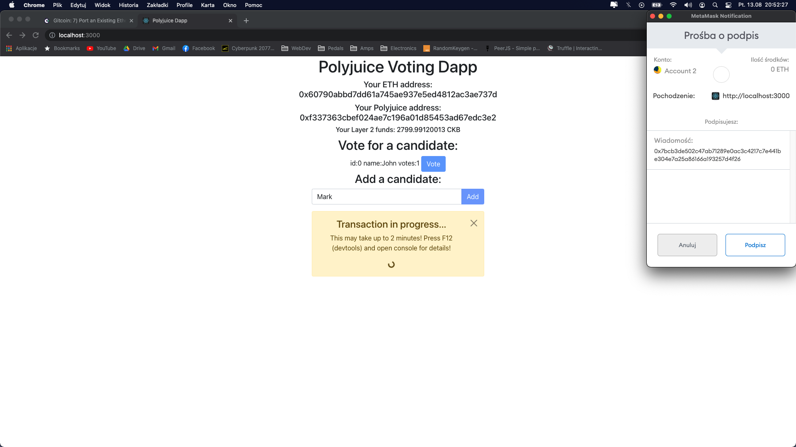

# Gitcoin: 7) Port An Existing Ethereum DApp To Polyjuice

## Introduction
Hello! I've made a simple voting dapp using Polyjuice and Godwoken. It's is based on my own smartcontract that I've created recently. App was made with React. It's required to use `npm install` command to install all needed dependecies and `npm start` to run it.
Here is a link to working ETH version of this Dapp, which is using Rinkeby Testnet: https://el-tumero.github.io/ethvoting/

## 1. Screenshots or video of application:
Video demo link: https://www.youtube.com/watch?v=QRcukbeQzLA&ab_channel=tumer



## 2. Link to the GitHub repository:
https://github.com/el-tumero/nervosdapp

## 3. More:
### 3.1 Transaction hash
```sh
0x91960541da5b1086b0da279f9cbec3ad3ef836cb3a8438f5b7bc2c2814cb90af
```
### 3.2 Deployed contract address:
```sh
0x4672dAeAa15816aaDcdE82d19d69C17020f62ccb
```
### 3.3 ABI
```json
    "abi": [
        {
            "inputs": [],
            "stateMutability": "payable",
            "type": "constructor"
        },
        {
            "inputs": [
                {
                    "internalType": "string",
                    "name": "_name",
                    "type": "string"
                }
            ],
            "name": "addCandidate",
            "outputs": [],
            "stateMutability": "payable",
            "type": "function"
        },
        {
            "inputs": [
                {
                    "internalType": "uint256",
                    "name": "",
                    "type": "uint256"
                }
            ],
            "name": "candidates",
            "outputs": [
                {
                    "internalType": "uint256",
                    "name": "id",
                    "type": "uint256"
                },
                {
                    "internalType": "string",
                    "name": "name",
                    "type": "string"
                },
                {
                    "internalType": "uint256",
                    "name": "voteCount",
                    "type": "uint256"
                }
            ],
            "stateMutability": "view",
            "type": "function"
        },
        {
            "inputs": [],
            "name": "candidatesCount",
            "outputs": [
                {
                    "internalType": "uint256",
                    "name": "",
                    "type": "uint256"
                }
            ],
            "stateMutability": "view",
            "type": "function"
        },
        {
            "inputs": [],
            "name": "showCandidates",
            "outputs": [
                {
                    "components": [
                        {
                            "internalType": "uint256",
                            "name": "id",
                            "type": "uint256"
                        },
                        {
                            "internalType": "string",
                            "name": "name",
                            "type": "string"
                        },
                        {
                            "internalType": "uint256",
                            "name": "voteCount",
                            "type": "uint256"
                        }
                    ],
                    "internalType": "struct Voting.Candidate[]",
                    "name": "",
                    "type": "tuple[]"
                }
            ],
            "stateMutability": "view",
            "type": "function"
        },
        {
            "inputs": [
                {
                    "internalType": "uint256",
                    "name": "_id",
                    "type": "uint256"
                }
            ],
            "name": "vote",
            "outputs": [],
            "stateMutability": "payable",
            "type": "function"
        }
    ]
```
